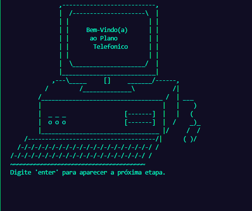
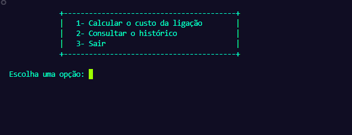

# 📁 Meus Projetos em Python

Bem-vindo(a) ao meu repositório! Aqui você encontrará alguns dos projetos que desenvolvi em Python, focando em lógica de programação, manipulação de dados e construção de menus interativos no terminal. Abaixo estão os detalhes de cada projeto.

---

## 📞 Plano Telefônico

**Arquivo:** `planotelefonico.py`

Esse projeto simula um sistema de cálculo de custo de ligações entre diferentes DDDs. O usuário pode:
- Informar o DDD de origem e destino, além da duração da chamada.
- Ver o custo baseado em uma tabela fixa de tarifas.
- Consultar um histórico das últimas cinco ligações realizadas.

🎯 Ideal para treinar lógica condicional e estrutura de repetição com menus em terminal.

---

## 🛒 Simulador de Produtos e Lucro

**Arquivo:** `produtos.py`

Uma pequena aplicação para simular a adição de produtos com custo e margem de lucro, e calcular:
- O preço de venda com base na margem.
- O total do carrinho de compras.
- O lucro total estimado.

Permite adicionar produtos e simular compras com foco no aprendizado de listas, funções e cálculos simples.

---

## 🌱 Dedos Verde

**Arquivo:** `Dedos Verde.py`

Projeto com um toque divertido e educativo que permite:
- Cadastrar e visualizar plantas (como briófitas, pteridófitas, gimnospermas e angiospermas).
- Registrar ambientes com diferentes níveis de luz, temperatura e umidade.
- Verificar se uma planta pode sobreviver em determinado ambiente.
- Ver os cuidados ideais para cada tipo de planta.

Excelente para treinar **POO (Programação Orientada a Objetos)** de forma prática e criativa.

---
